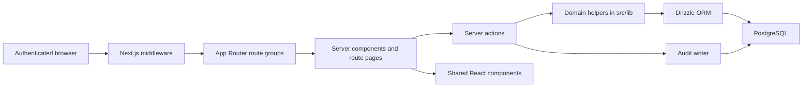
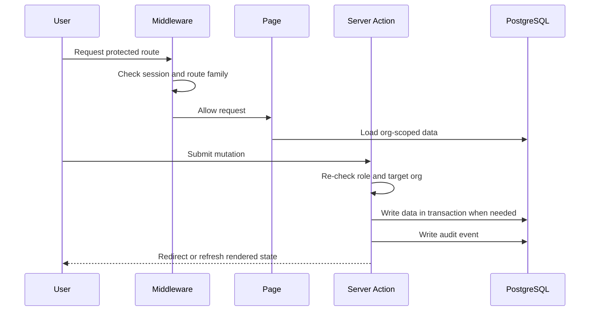

# Application Overview

GovEA is a Next.js App Router application for maintaining an enterprise architecture repository. The implementation is intentionally simple: server-rendered pages, server actions for mutations, Drizzle for typed database access, and PostgreSQL as the system of record.

## Primary Runtime Shape

## Application Layers

| Layer | Location | Responsibility |
|---|---|---|
| Routes and pages | `apps/govea/src/app/` | URL structure, server-rendered pages, route groups, and page-level data loading |
| Server actions | `apps/govea/src/actions/` | Mutations, role gates, validation, relationship updates, and audit calls |
| Domain helpers | `apps/govea/src/lib/` | Cross-cutting behavior such as RBAC, federation, confidence, audit, search, URL helpers, and support access |
| Database schema | `apps/govea/src/db/schema/` | Drizzle table definitions, enums, and relationship tables |
| Seed data | `apps/govea/src/db/seeds/` | Demo, dogfood, test, scale, and TOGAF-overlay fixture data |
| UI components | `apps/govea/src/components/` | Shared page widgets, shell components, forms, banners, diagrams, and controls |

## Route Groups

GovEA uses App Router route groups to separate user experiences without adding visible path segments.

| Route group | Path examples | Purpose |
|---|---|---|
| `(auth)` | `/login`, `/setup`, `/auth-redirect`, `/error` | Authentication and bootstrap flows |
| `(admin)` | `/dashboard`, `/applications`, `/capabilities`, `/roadmap`, `/settings` | Main organization-scoped EA workspace |
| `(instance)` | `/instance`, `/instance/orgs`, `/instance/users` | Instance-admin platform operations |
| API routes | `/api/auth/*`, `/api/auth/logout`, `/api/applications/export` | Auth.js endpoints, the deploy-stable sign-out handler, and data exports — the planned `/api/v1` REST surface (#775) will live here |
| root routes | `/`, `/maintenance` | Landing redirect and maintenance surface |

The main workspace is organization-scoped. The instance console is deliberately separate because `instance_admin` is an operating role for platform support, not a blanket content role inside every tenant.

## Request Flow

Middleware performs coarse route protection. Server actions and domain helpers perform the authoritative checks for write behavior, target organization, and support-access boundaries.

## Main Product Areas

| Product area | Architectural role |
|---|---|
| Business Architecture | Personas, capabilities, services, value streams, principles, glossary, and relationship context |
| Portfolio | Applications, ADRs, architecture debt, and technology impact context |
| Strategy and Planning | Goals, strategic objectives, initiatives, roadmap, and executive views |
| Data Architecture | Data entities, attributes, business keys, links, semantic relationships, and diagram views |
| Reports and Answers | Read-oriented summaries built from existing repository relationships |
| Configuration | Users, taxonomy, org settings, notices, modules, and instance feature controls |

## Cross-Cutting Services

| Concern | Current implementation |
|---|---|
| Authentication | Auth.js with local credentials and optional OIDC SSO (current provider wiring targets Microsoft Entra ID); deploy-stable logout endpoint with a logged-out marker guarding against post-logout session resurrection (ADR-0003) |
| Authorization | Per-membership org roles with an active-organization context (#693), plus separate `instance_admin` operating role |
| Audit | Audit log made append-only by a DB trigger; covers content, identity, instance, and support-access events with IP/user-agent on auth events and an instance telemetry view |
| Taxonomy & recipes | Org-scoped controlled vocabularies reused across entity types; curated sets (e.g. TOGAF 10) install idempotently through the recipe engine, with audience markers hiding framework jargon from viewers |
| Reports | Generic group-by-taxonomy report engine with presets, plus completeness surfaces such as the duplicate-candidates report |
| Modules | Org-level module settings and instance-wide module availability controls |
| Search | Embedded repository-wide search over core content |
| Federation | Connection-aware visibility and approval-based cross-org links |
| Demo data | Seeded Riverdale, GovEA Project dogfood org, Hartfield TOGAF demo (recipe-installed), scale data, and system org |

## Planned Architectural Seams

Two decided roadmap items change what an architect should expect from this shape:

- **REST API foundation (#775, v1.0)** — `/api/v1` read/write endpoints with token auth, RBAC/audit parity with the UI, generated OpenAPI, and bulk import. Route handlers join server actions as a first-class mutation surface; the same authorization helpers must serve both.
- **First Tier-1 sync: ServiceNow ITSM/CMDB (#382, v2.0)** — built on the REST API foundation; integrations populate context and never silently overwrite architect-authored content.

## Design Bias

GovEA should stay biased toward:

- plain-language architecture content over formal notation
- relationship-driven traceability over heavy workflow engines
- organization isolation by default
- small product slices tied to personas and capability IDs
- demo/sample data that exercises real GovEA behavior instead of decorative examples
