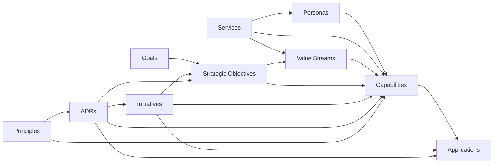

# Data and Traceability Architecture

GovEA's repository model is centered on mission-first traceability. The basic chain is:

```text
Goals -> Strategic Objectives -> Initiatives -> Capabilities -> Applications
```

Personas and services provide the people-and-delivery context around that chain. Decisions, principles, data architecture, and reporting add governance and portfolio context without replacing the mission-first path.

For field-level schema detail, see `docs/data-model.md`.

## Core Traceability Model



Applications are intentionally surfaced for services and objectives through linked capabilities rather than through direct service-to-application or objective-to-application joins. That keeps mission traceability anchored in capabilities. Value streams additionally carry direct capability mappings (#757) so stream-level views do not depend on stage-by-stage links.

Traceability has two kinds of entry point (#695): **roots** (goals, objectives, capabilities, services) get native `from=` drill-downs on `/traceability`, while every other participating entity (applications, initiatives, personas, value streams, ADRs, principles) gets a participation view — its one-hop connections into the native traces — so any record can answer "how does this connect?" without inventing per-entity trace engines.

## Relationship Patterns

| Pattern | Used for | Notes |
|---|---|---|
| Direct FK | Ownership and parent-child relationships | Example: content records to `organizations` |
| Junction table | Many-to-many relationships | Example: `application_capabilities`, `capability_personas` |
| Junction with metadata | Relationship plus meaning | Example: initiative capability/application impact labels |
| Relationship table without FK to target entity table | Cross-org links | Used where target entity type and organization vary |
| Derived relationship | Read model assembled from existing links | Example: applications shown on service/objective views through capabilities |

## Content Lifecycle

Most publishable content uses `workflow_status`:

| Status | Meaning |
|---|---|
| `draft` | Work in progress; generally hidden from viewers |
| `published` | Viewer-visible when route and visibility allow |
| `archived` | Retained for history but not current |

Some entities use domain-specific statuses:

- ADRs: `proposed`, `accepted`, `deprecated`, `superseded`
- Initiatives: `proposed`, `active`, `on-hold`, `complete`, `cancelled`

This split is intentional for now. Planning entities represent work lifecycle, while most architecture content follows publish/archive semantics.

## Data Architecture Module

The Data Architecture module adds a dedicated metamodel for data architecture work:

| Object | Purpose |
|---|---|
| Data entity | Business data concept or object being described |
| Data attribute | Data element or attribute with physical classification |
| Business key | Identifier associated with a data entity |
| Data link | Data Vault-style relationship/link object |
| Semantic relationship | Cross-object relation among entities and attributes |
| Diagram | Read-only Chen-style visualization of the current metamodel |

Data Architecture is connected to the same organization, role, workflow, and visibility rules as the rest of the repository.

## Taxonomy and Recipes

Taxonomy is the shared controlled-vocabulary foundation. It supports domain and classification values across several product areas instead of creating one-off vocabulary tables for each entity.

Current uses include:

- capability domains
- persona types
- persona tags
- application type
- capability priority
- objective category
- initiative type
- decision category
- principle scope

Structural pieces an architect should know:

- Types and their values are org-scoped `taxonomy_terms` rows (parent/child); `entity_taxonomy_definitions` binds a type to the entity kinds it classifies.
- Types carry an **audience** marker — framework-flavored types (e.g. ADM Phase) are hidden from viewer-role users and stakeholder reports, preserving the plain-language promise without forbidding the vocabulary.
- **Recipes** install curated bundles (taxonomy types and values, glossary terms, principles, report presets) idempotently via the recipe-install engine. Framework support is recipe-shaped, not code-shaped: the TOGAF 10 starter replaced the former hard-coded framework overlay, and ADM stages exist as classification only — never workflow ([ADR-0002](../decisions/0002-adm-as-classification.md)).
- The generic group-by-taxonomy report engine renders any bound type as a report; presets (including TOGAF views) are data, not pages.

When adding a new classification, prefer taxonomy if the value is user-manageable, org-scoped, and likely to be reused across records. When shipping a curated vocabulary, prefer a recipe over seed-code or bespoke tables.

## Audit and Completeness

The repository is designed to be self-auditing:

- mutations should write audit events
- completeness signals identify missing or stale relationships
- repository-confidence summaries convert maintenance state into stakeholder-facing trust cues
- architecture debt records capture known concerns and system-detected lifecycle risk
- the duplicate-candidates report (#718) scans every entity type plus taxonomy values and entity-taxonomy assignments for exact and near-duplicate names, surfacing candidate groups for human review — it never auto-merges

Completeness and confidence should remain signals for better human judgment, not hidden automation that changes architecture content without review.

## Traceability Rules for New Work

When adding a new content type or major relationship:

1. Identify the persona and capability reason for the data.
2. Decide whether the relationship should be direct, many-to-many, derived, or cross-org.
3. Define viewer visibility and workflow behavior up front.
4. Add audit coverage for writes.
5. Update seed data when the feature should appear in the demo or GovEA Project dogfood org.
6. Update `docs/data-model.md` when the schema surface changes.

New implementation issues and PRs should continue using the traceability convention from `Standards.md`:

```text
Capability: <capability-id>
Persona: <persona name>
```
