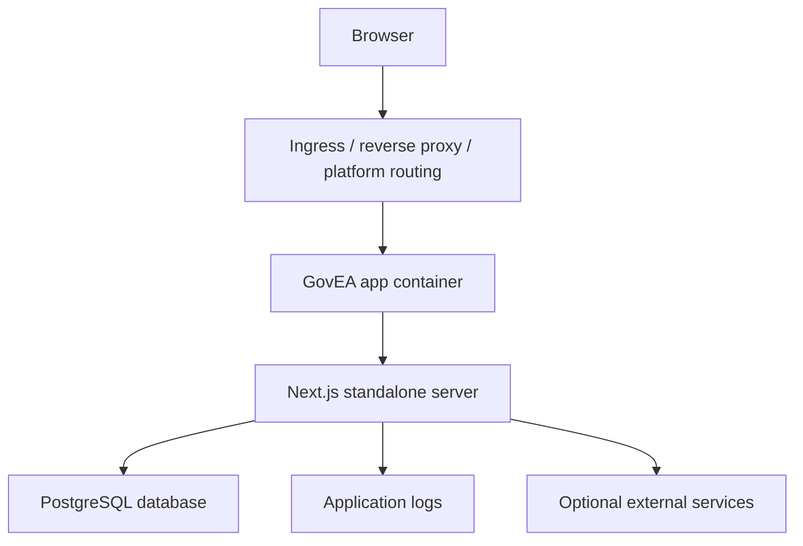
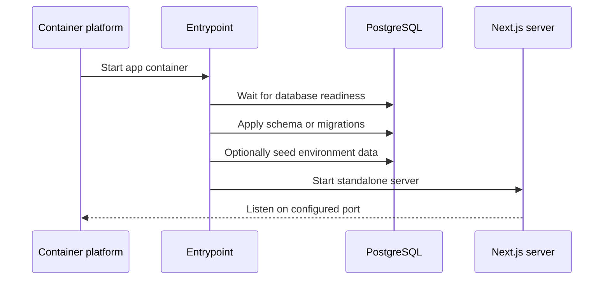
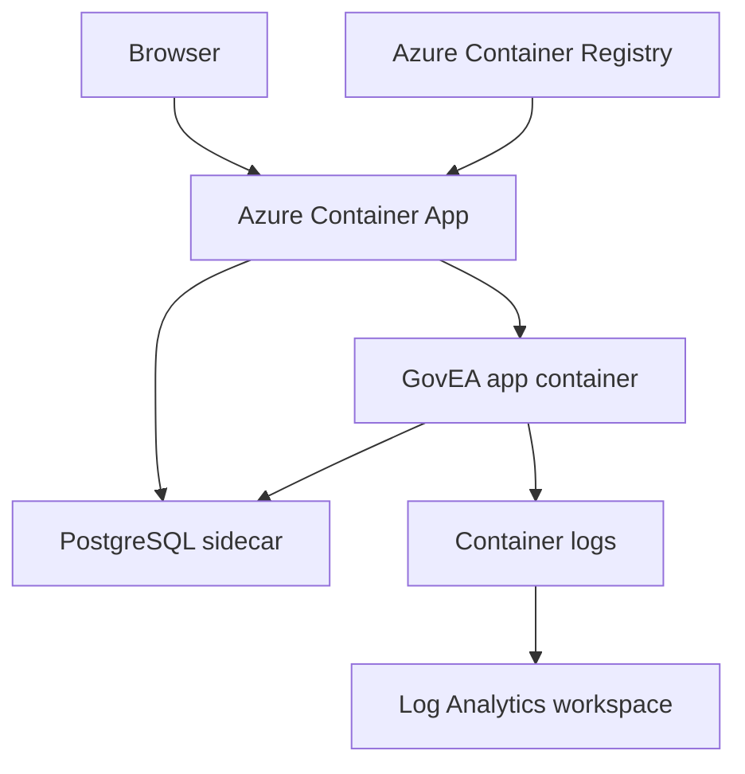

# Runtime and Deployment Architecture

GovEA is designed around portable containers. The application should be able to run in a local developer environment, a self-hosted container runtime, a government-managed platform, or a hosted cloud container service without changing the application architecture.

Azure Container Apps is the current shared demo target. It is not the architectural boundary.

## Runtime Model



The portable runtime assumptions are:

- GovEA runs as a containerized Next.js application.
- PostgreSQL is the system of record.
- Runtime configuration is supplied through environment variables.
- The container should run a production Next.js standalone server outside local development.
- Logs should go to the hosting platform's normal container log stream.
- Deployment targets should not require code changes for ordinary environment differences.

## Deployment Targets

| Target | Current use | Notes |
|---|---|---|
| Local host + containerized Postgres | Fast development | App runs with `pnpm dev`; database runs in Docker or Podman |
| Local full container stack | Container behavior testing | App and database both run through compose |
| Self-hosted container platform | Future on-prem or agency-managed installs | Could be Docker, Podman, Kubernetes, OpenShift, or another container runtime |
| Hosted cloud container platform | Shared demo and hosted deployments | Azure Container Apps is the current demo implementation |

This portability is why container behavior should stay generic where possible. Cloud-specific scripts can exist, but the application should not depend on Azure-only assumptions.

## Container Components

| Component | Responsibility |
|---|---|
| App image | Builds the Next.js standalone app and carries runtime entrypoints |
| PostgreSQL | Stores GovEA tenant, content, auth, audit, taxonomy, and relationship data |
| Entrypoint | Waits for database readiness, applies schema behavior appropriate to the environment, optionally seeds data, then starts the server |
| Environment variables | Provide database URL, auth settings, public app URL, demo flags, and operational toggles |
| Log stream | Exposes startup, migration, seed, request, and error output through the hosting platform |

## Local Development

Common local paths:

| Command | Purpose |
|---|---|
| `pnpm demo:start` | Start local app with containerized Postgres |
| `pnpm demo:db` | Start only the database |
| `pnpm demo:container` | Run the full container stack |
| `pnpm --filter govea dev` | Start the Next.js app after database setup |
| `pnpm --filter govea db:push` | Sync schema directly from `src/db/schema/` (pre-production policy — there are no migration files yet; see CLAUDE.md) |
| `pnpm --filter govea db:apply-triggers` | Re-apply Postgres triggers and DB-level constraints after a push |
| `pnpm --filter govea db:seed` | Load demo seed data |

`db:migrate` exists in `package.json` but is intentionally not the current command — pre-production uses `db:push --force` everywhere, including CI. The switch to migrations happens when the first real tenant data exists; CLAUDE.md tracks the checklist.

Podman is preferred when available, but the compose helper can fall back to Docker.

## Runtime Configuration

| Variable | Purpose |
|---|---|
| `DATABASE_URL` | PostgreSQL connection string |
| `AUTH_SECRET` | Stable Auth.js secret |
| `NEXT_PUBLIC_APP_URL` | Public base URL used by auth and generated links |
| `AUTH_TRUST_HOST` | Allows Auth.js to trust platform-provided host headers when needed |
| `NODE_ENV` | Should be `production` for deployed container runtime |
| `DEMO_MODE` | Enables demo affordances such as login shortcuts |
| `DEV` | Enables development/demo fixture behavior where still used |
| `MAINTENANCE_MODE` | Redirects non-admin traffic to the maintenance page |

Demo data should be controlled through explicit demo flags, not by running a deployed environment with `next dev` or `NODE_ENV=development`.

## Generic Startup Flow



The exact schema step depends on the environment. Disposable demo environments can use schema push and idempotent seed data. Persistent production tenants should use explicit migrations and conservative seed behavior.

## Container Build Notes

The container files pin pnpm to the repository package-manager version before dependency installation. This matters because base images can ship a newer global pnpm that does not support the repo's Node version.

Build-sensitive files:

- `docker/Containerfile.dev`
- `docker/Containerfile`
- `docker/entrypoint.dev.sh`
- `docker/entrypoint.prod.sh`
- `docker/entrypoint.azure-dev.sh`
- `docker/docker-compose.yml`
- `docker/podman-compose.yml`
- `scripts/azure-dev.sh`
- `package.json`
- `pnpm-lock.yaml`

When changing package-manager, Node, container base-image, or entrypoint behavior, validate both CI and at least one real container build path. CI can pass while a container build fails if the base image has a different global toolchain.

## Azure Demo Implementation

Azure demo deployments can run in Azure Container Apps through `scripts/azure-dev.sh`. Operator-specific Azure account details are intentionally not documented in this public repository.



The Azure demo uses:

- Azure Container Registry for image builds and storage
- Azure Container Apps for runtime
- a PostgreSQL sidecar reachable on `localhost:5432`
- production Next.js standalone runtime
- explicit demo flags through environment variables
- Log Analytics for platform log collection

The demo deployment script supports:

| Command | Purpose |
|---|---|
| `bash scripts/azure-dev.sh deploy` | Create Azure resources and first deployment |
| `bash scripts/azure-dev.sh update` | Build a new image in ACR and roll out a new revision |
| `bash scripts/azure-dev.sh status` | Show current image and replica settings |
| `bash scripts/azure-dev.sh logs` | Stream app logs |
| `bash scripts/azure-dev.sh stop` | Scale to zero replicas |
| `bash scripts/azure-dev.sh start` | Restore one replica |

The update path builds remotely with `az acr build`, pushes a timestamped image tag, then updates the Container App image reference.

## Operational Checks

After any deployment, verify the target-specific health signal and the generic app behavior:

- active revision, pod, task, or container is healthy
- expected image tag or digest is running
- `/login` returns HTTP 200 and carries the security response headers (X-Frame-Options, nosniff, HSTS, report-only CSP — configured in `next.config.ts`, #743)
- sign-out works post-deploy (the deploy-stable logout endpoint exists precisely because stale tabs used to fail after rollouts, #759)
- logs show schema/migration completion, optional seed completion, and Next server ready
- no recurring auth, database pool, server-action, or static asset errors

Azure demo commands:

```bash
bash scripts/azure-dev.sh status
az containerapp revision list --name "$GOVEA_AZURE_CONTAINERAPP" --resource-group "$GOVEA_AZURE_RG" -o table
az containerapp logs show --name "$GOVEA_AZURE_CONTAINERAPP" --resource-group "$GOVEA_AZURE_RG" --tail 120
curl -I -L "$(bash scripts/azure-dev.sh url)/login"
```

## Current Limitations

- Traceable release automation belongs in a private operator-owned repository or another private deployment system, not in this public repo.
- The shared demo uses a sidecar Postgres instance, not a managed production database.
- Rollback is manual through the target platform's image or revision controls unless the private operator deployment system provides a rollback workflow.
- The Azure deployment script records image tags in output, but this public repository does not persist operator release records automatically.
- Production deployment guidance for non-Azure container platforms is still intentionally light.

Issue #504 tracks the release-pipeline work needed to make demo deployment traceable by commit, image digest, revision, smoke result, and rollback path.
