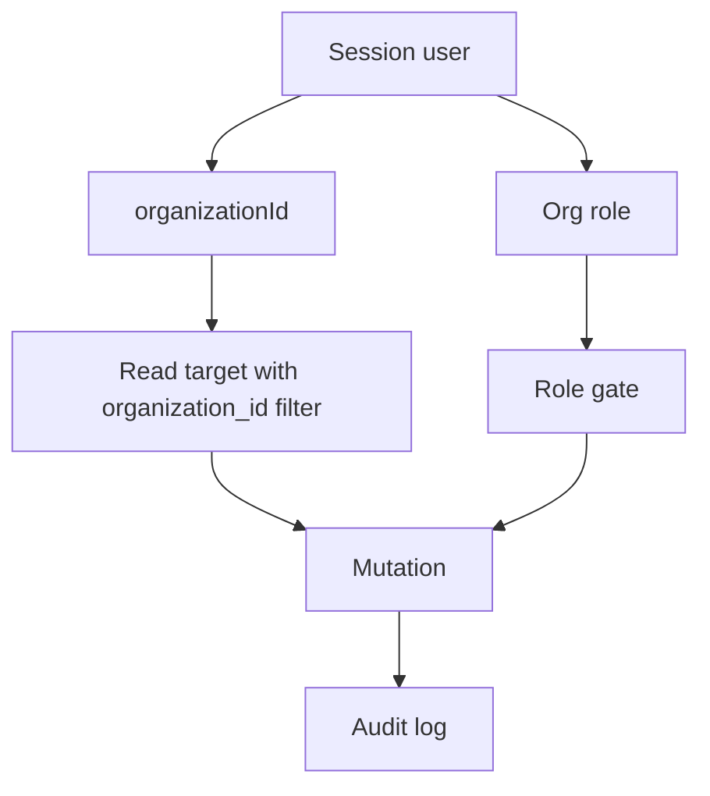

# Security and Tenancy Architecture

GovEA is multi-tenant at the application layer. The normal operating boundary is the organization. Content records carry `organization_id`, and cross-organization behavior is explicit rather than implicit. Users can hold memberships in multiple organizations, but every request operates in the context of exactly one **active organization**.

## Identity Model

GovEA supports two sign-in paths:

| Sign-in path | Purpose | Notes |
|---|---|---|
| Local credentials | Development, fallback, and self-hosted operation | Password hashes are stored for local users |
| OIDC SSO | Government SSO path | Current provider wiring targets Microsoft Entra ID; Okta, Auth0, or other OIDC providers fit the same architectural pattern |

Auth is implemented with Auth.js in `apps/govea/src/lib/auth.ts`. The current code uses the Microsoft Entra ID provider package, but the architectural boundary is OIDC-backed SSO plus pre-provisioned GovEA users rather than a Microsoft-only identity model. Middleware (`apps/govea/src/middleware.ts`) stays edge-safe by decoding the session JWT directly with `getToken` — pure claim reads, no Node-only APIs, and no session-cookie writes ([ADR-0003](../decisions/0003-middleware-reads-tokens-never-writes.md)).

SSO does not auto-create usable tenant users. The sign-in callback checks that the external identity maps to a pre-provisioned, active user with at least one active organization membership. This keeps tenant access admin-managed.

## Memberships and the Active Organization

Since #693, the user–organization relationship is a membership model, not a column on the user:

- `user_organization_memberships` holds one row per user per organization, each carrying its **own org-scoped role** — the same person can be `admin` in one org and `viewer` in another.
- Every session resolves an **active organization** (last-selected, falling back to a deterministic default). All org-scoped reads, writes, and role checks evaluate against the active membership only.
- Users with multiple memberships switch via the org switcher; switching updates the session through the Auth.js session endpoint and fires the jwt callback — privileges never blend across memberships.
- Instance admins manage memberships across organizations through the instance console; org admins manage members inside their org, with a per-org last-admin guard.

## Roles

| Role | Scope | Intent |
|---|---|---|
| `admin` | Per membership | Full tenant administration and content management in that org |
| `contributor` | Per membership | Create and edit EA content, without user management or destructive admin powers |
| `viewer` | Per membership | Read viewer-visible published content |
| `instance_admin` | Instance | Platform operations across organizations through the instance console |

`instance_admin` is stored on the user, separately from membership roles. It does not mean the user owns every organization's architecture content.

## Route Protection

Middleware handles coarse protection. Per [ADR-0003](../decisions/0003-middleware-reads-tokens-never-writes.md) it decodes the session JWT **read-only** via `getToken` and never writes session cookies — the only session-cookie writers are the Auth.js endpoints and the logout handler:

- `/api/auth/*` is excluded from the middleware matcher entirely (those endpoints manage the session cookie themselves)
- public paths: `/login`, `/setup`, `/error`, `/maintenance`; static assets are allowed
- unauthenticated users are redirected to `/login`
- the **logged-out marker** guard rejects session tokens issued before the last sign-out and actively deletes their cookies (post-logout resurrection defense, #782)
- maintenance mode redirects non-admin users to `/maintenance`
- `/instance` routes require `instance_admin`
- expired-password sessions are redirected to `/change-password`, with sign-out still reachable (#527)

This is only the outer gate. Server actions still need to enforce role, organization, and target-record rules.

## Session Lifecycle

| Event | Behavior |
|---|---|
| Login | Auth.js issues a rolling JWT session cookie (24h maxAge); `events.signIn` clears any logged-out marker and writes an `auth.login` audit row with IP/user-agent |
| Refresh | Session expiry extends through the Auth.js session endpoint and server-side `auth()` calls — never through middleware (ADR-0003) |
| Sign-out | A plain form posts to the deploy-stable `/api/auth/logout` route handler (no Server Action id, so stale tabs survive deployments, #759); the handler fires the `auth.logout` audit event, explicitly expires every session-token cookie including large-JWT chunks, sets the logged-out marker, and 303s to `/login` with no caller-controlled redirect |
| Post-logout | Any straggler response carrying a rolled pre-logout token is rejected and deleted by the middleware marker guard; logout succeeds even if the audit write fails — cookie clearing never depends on the database |

## Tenant Boundary

Most business records include `organization_id`. Server actions should follow this pattern:

1. Read the current session.
2. Resolve the caller's organization and role from trusted session fields.
3. Load target records by both `id` and `organization_id`.
4. Reject cross-org writes unless a specific federation or support path allows them.
5. Write an audit event for security-relevant changes.

## Visibility and Federation

Content visibility is explicit:

| Visibility | Meaning |
|---|---|
| `org` | Visible only inside the owning organization |
| `connections` | Visible to directly connected organizations when federation rules allow it |
| `instance` | Visible across the GovEA instance where supported |

Federation uses:

- `org_connections` for explicit organization relationships
- `cross_org_links` for approved relationships between content objects
- read-only remote detail views for linked external content

Cross-org links must not become a back door around source visibility. Org-private source content should not be exposed through federation.

## Support Access

Instance support access is deliberately narrower than tenant administration.

| Mechanism | Purpose |
|---|---|
| Break-glass session | Time-bound, audited support access request for a target organization |
| Act-as session | Scoped support action path tied to an active break-glass parent |
| Instance audit log | Operator-visible record of platform and support actions |

Every cross-tenant support action should record the real actor, target tenant, reason/context, and support-session identifiers. A revoked or expired break-glass session must terminate dependent support behavior.

## Audit Requirements

Audit events are part of the security model, not just diagnostics. Mutations that affect identity, tenant status, support access, content visibility, relationships, or published architecture state should write audit records.

The audit log stores:

- actor user id when known
- organization id when applicable
- action name
- entity type and entity id
- before/after snapshots when useful
- metadata for support context, reasons, impersonated orgs, or request details

Hardening already in place:

- **Append-only at the database layer**: a Postgres trigger blocks UPDATE and DELETE on `audit_log` (#417) — even a compromised admin role cannot rewrite history
- **Auth telemetry**: login/logout events capture client IP and user-agent; repeated failed logins are aggregated for instance review, and instance admins have an audit telemetry view with CSV export (#720)

## Hardening Posture

- Security response headers ship on every response (X-Frame-Options DENY, nosniff, referrer policy, HSTS) with a Content-Security-Policy in **report-only** mode pending nonce/hash rollout (#743; enforcement is #765)
- Org theme values are allowlisted before injection into the inline `<style>` tag, making style-tag breakout structurally impossible (#769)
- Open hardening work is tracked in the v1.0 security wave: MFA for local credentials (#761), CI dependency/code scanning (#762), CSV formula-injection neutralization (#763), database TLS enforcement (#764), audit retention for public-records compliance (#767)

## Security Design Notes

- Never trust caller-supplied `organizationId` or `role` for authorization.
- Resolve role from the **active membership**, never from a stale per-user field.
- Prefer server-side relationship checks over client-side hiding.
- Keep instance-admin features visibly separate from org-admin features.
- Treat federation as read/link coordination, not ownership transfer.
- Keep local auth available as an SSO fallback so administrators are not locked out when an identity provider is unavailable.
- Never write session cookies outside the Auth.js endpoints and the logout handler (ADR-0003).
