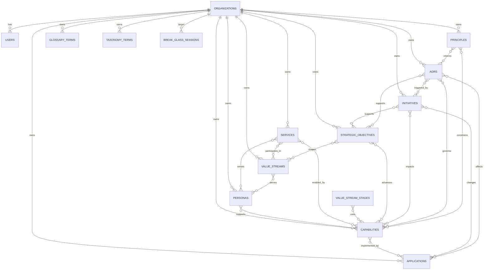

# GovEA Data Model Reference

This document describes the current implementation data model in `apps/govea/src/db/schema/`.

It is intentionally implementation-focused:
- what tables exist today
- what fields each table stores
- which fields are required, optional, or enum-backed
- how the major many-to-many relationships are modeled

Recent product-shape changes reflected here:
- `services` is a first-class entity in the portfolio model
- persona types and persona tags are taxonomy-backed, not separate vocabulary tables
- `principles.principle_type` is now taxonomy-backed text rather than a fixed enum
- applications are surfaced for services and strategic objectives through capabilities, not through direct service/objective application joins
- instance-admin schema and console primitives now exist, including `users.instance_role`, `organizations.is_system_org`, org suspension fields, and `break_glass_sessions`

For product intent, personas, and capability definitions, see `business-architecture/`.

## Design Conventions

Most content tables follow the same basic shape:

| Field pattern | Meaning |
|---|---|
| `id` | UUID primary key generated by the database |
| `organization_id` | Tenant boundary; almost all business data belongs to exactly one organization |
| `created_by`, `updated_by` | Optional FK to `users.id` for authorship tracking |
| `created_at`, `updated_at` | Timestamps for record lifecycle |
| `status` | Workflow or domain-specific status; some tables use shared workflow, others use a table-specific enum |
| `visibility` | Publication scope: `org`, `connections`, or `instance` |

Shared enum semantics:

| Enum | Values | Used by |
|---|---|---|
| `visibility` | `org`, `connections`, `instance` | Most publishable content |
| `workflow_status` | `draft`, `published`, `archived` | Personas, capabilities, applications, services, value streams, objectives, principles, glossary |
| `user_role` | `admin`, `contributor`, `viewer` | Org-scoped user authorization |

## Top-Level Model

## Core Tables

### `organizations`

Represents the tenant boundary for almost all business data.

| Field | Type | Required | Notes |
|---|---|---|---|
| `id` | UUID | Yes | Primary key |
| `name` | text | Yes | Display name |
| `slug` | text | Yes | Unique tenant slug |
| `theme` | text | Yes | Theme id; defaults to `govea` |
| `enabled_modules` | JSONB | Yes | Feature/module flags; defaults to `{}` |
| `is_system_org` | boolean | Yes | Marks the operator/system organization for instance administration; defaults to `false` |
| `parent_id` | UUID | No | Self-reference for hierarchy; `SET NULL` on delete |
| `suspended_at` | timestamp | No | Set when an instance admin suspends the organization |
| `suspended_reason` | text | No | Audit-facing reason for suspension |
| `created_at` | timestamp | Yes | Defaults to `now()` |
| `updated_at` | timestamp | Yes | Defaults to `now()` |

### `users`

Authenticated users. Users remain organization-scoped even when they also carry an instance-scoped operating role.

| Field | Type | Required | Notes |
|---|---|---|---|
| `id` | UUID | Yes | Primary key |
| `organization_id` | UUID | Yes | FK to `organizations.id`; cascade delete |
| `name` | text | No | Display name |
| `email` | text | Yes | Unique within an organization |
| `email_verified` | timestamp | No | Auth.js-compatible email verification field |
| `image` | text | No | Profile image URL |
| `password_hash` | text | No | Present for local auth users |
| `role` | `user_role` enum | Yes | Org-scoped role; defaults to `viewer` |
| `instance_role` | text | No | Instance-scoped role; currently used for `instance_admin` |
| `is_active` | text | Yes | Stored as text; defaults to `'true'` |
| `created_at` | timestamp | Yes | Defaults to `now()` |
| `updated_at` | timestamp | Yes | Defaults to `now()` |

Additional Auth.js support tables:
- `accounts`: external provider account bindings
- `sessions`: persisted login sessions
- `verification_tokens`: email/token verification records

### Portfolio and Planning Content

| Table | Purpose | Key relationship notes |
|---|---|---|
| `personas` | People-centered anchor objects representing who the organization serves | Tags are stored through `persona_tags`; selected persona type is stored as text from taxonomy |
| `capabilities` | Business capabilities linked to personas and applications | Applications must link to at least one capability at the application layer |
| `applications` | Technology/application portfolio records | Linked to capabilities, initiatives, and ADRs |
| `services` | Government-facing service records | Linked to personas, capabilities, and value streams; supporting applications are derived through linked capabilities |
| `strategic_objectives` | Strategy records | Linked to capabilities and value streams; supporting applications are derived through linked capabilities |
| `initiatives` | Change initiatives | Linked to capabilities, objectives, and applications; capability/application links can carry free-text impact labels |
| `adrs` | Architecture Decision Records | Linked to capabilities, applications, initiatives, and objectives; can supersede another ADR |
| `principles` | Architecture principles | Linked to capabilities and ADRs; `principle_type` stores the taxonomy term slug |
| `glossary_terms` | Shared terminology with optional source attribution | Source definitions live in `glossary_term_sources` |
| `value_streams` | End-to-end value delivery flows | Linked to personas; stages link to capabilities |
| `taxonomy_terms` | Org-scoped controlled vocabulary hierarchy | Used for capability domains, persona types, persona tags, and other controlled terms |

Most portfolio tables include `organization_id`, optional `created_by`/`updated_by`, timestamps, `status`, and `visibility`.

Status details that are not shared workflow:
- `adrs.status`: `proposed`, `accepted`, `deprecated`, `superseded`
- `initiatives.status`: `proposed`, `active`, `on-hold`, `complete`, `cancelled`

## Federation and Visibility Tables

### `org_connections`

Explicit bilateral organization connections required for `connections`-scope sharing.

| Field | Type | Required | Notes |
|---|---|---|---|
| `id` | UUID | Yes | Primary key |
| `from_org_id` | UUID | Yes | Source organization |
| `to_org_id` | UUID | Yes | Target organization |
| `status` | `connection_status` enum | Yes | `pending`, `active`, `rejected` |
| `created_by` | UUID | No | FK to user |
| `created_at` | timestamp | Yes | Defaults to `now()` |
| `updated_at` | timestamp | Yes | Defaults to `now()` |

Constraint:
- unique on `(from_org_id, to_org_id)`

### `cross_org_links`

Cross-org relationships between content items. These intentionally avoid FKs on source/target entity ids because they may point across organizations and entity tables.

| Field | Type | Required | Notes |
|---|---|---|---|
| `id` | UUID | Yes | Primary key |
| `source_org_id` | UUID | Yes | Owning org of the source entity |
| `source_entity_type` | text | Yes | Currently used for capability/persona cross-org links |
| `source_entity_id` | UUID | Yes | Source record id |
| `target_org_id` | UUID | Yes | Owning org of the target entity |
| `target_entity_type` | text | Yes | Currently used for capability/persona cross-org links |
| `target_entity_id` | UUID | Yes | Target record id |
| `link_type` | `link_type` enum | Yes | `implements`, `extends`, `maps_to` |
| `status` | `link_status` enum | Yes | `pending`, `active`, `rejected`; approval is required before a link becomes active |
| `rejection_reason` | text | No | Reason for rejection |
| `created_by` | UUID | No | FK to user |
| `created_at` | timestamp | Yes | Defaults to `now()` |
| `updated_at` | timestamp | Yes | Defaults to `now()` |

## Instance Administration Tables

### `break_glass_sessions`

Time-bound support sessions that let an instance admin request audited access to a target organization.

| Field | Type | Required | Notes |
|---|---|---|---|
| `id` | UUID | Yes | Primary key |
| `instance_admin_id` | UUID | Yes | FK to the instance-admin user who granted the session |
| `target_org_id` | UUID | Yes | FK to the target organization |
| `reason` | text | Yes | Mandatory support reason |
| `granted_at` | timestamp | Yes | Defaults to `now()` |
| `expires_at` | timestamp | Yes | Time-bound expiry |
| `revoked_at` | timestamp | No | Manual revocation timestamp |
| `revoked_by` | UUID | No | FK to the user who revoked the session |

Break-glass sessions are exposed through the instance-admin console and should be treated as audited support access, not normal tenant ownership.

## Audit Table

### `audit_log`

Immutable event log for content and security-relevant actions.

| Field | Type | Required | Notes |
|---|---|---|---|
| `id` | UUID | Yes | Primary key |
| `organization_id` | UUID | No | Set null if org is deleted; instance-level events use `null` |
| `user_id` | UUID | No | Set null if user is deleted |
| `action` | text | Yes | Event name like `create`, `update`, `delete`, `login`, or `instance.org.suspend` |
| `entity_type` | text | Yes | Entity category such as `persona`, `application`, `organization`, or `break_glass_session` |
| `entity_id` | UUID | No | Changed record id |
| `before` | JSONB | No | Snapshot before change |
| `after` | JSONB | No | Snapshot after change |
| `metadata` | JSONB | No | Auxiliary metadata such as IP or user agent |
| `created_at` | timestamp | Yes | Defaults to `now()` |

## Junction Table Summary

GovEA uses explicit many-to-many join tables rather than arrays or JSON relationships.

| Table | Connects | Extra metadata |
|---|---|---|
| `persona_tags` | personas <-> taxonomy terms | None |
| `capability_personas` | capabilities <-> personas | None |
| `application_capabilities` | applications <-> capabilities | None |
| `service_personas` | services <-> personas | None |
| `service_capabilities` | services <-> capabilities | None |
| `service_value_streams` | services <-> value streams | None |
| `value_stream_personas` | value streams <-> personas | None |
| `value_stream_stage_capabilities` | value stream stages <-> capabilities | None |
| `objective_capabilities` | objectives <-> capabilities | None |
| `objective_value_streams` | objectives <-> value streams | None |
| `initiative_capabilities` | initiatives <-> capabilities | `impact` |
| `initiative_objectives` | initiatives <-> objectives | None |
| `initiative_applications` | initiatives <-> applications | `impact` |
| `adr_capabilities` | ADRs <-> capabilities | None |
| `adr_applications` | ADRs <-> applications | None |
| `adr_initiatives` | ADRs <-> initiatives | None |
| `adr_objectives` | ADRs <-> objectives | None |
| `principle_adrs` | principles <-> ADRs | None |
| `principle_capabilities` | principles <-> capabilities | None |

Removed direct joins:
- `service_applications`
- `objective_applications`

Application context for services and objectives is resolved through the capability bridge.

## Field Metadata Notes

These details matter when writing migrations, actions, tests, or exports:

1. `visibility` is a publication scope, not an authorization role. Access still depends on application logic and federation state.
2. `status` is not uniform across all tables. Most content uses `workflow_status`, but initiatives and ADRs have their own enums.
3. Planning is intentionally split today: `strategic_objectives` use `workflow_status`, while `initiatives` use `initiative_status`.
4. Several planning and display fields are stored as free text instead of stricter types: `initiatives.start_date`, `initiatives.end_date`, `strategic_objectives.time_horizon`, and `applications.hosting_model`.
5. `capabilities.behaviors` and `capabilities.rules` are stored as newline-delimited text rather than structured child records.
6. `personas.type` stores the selected taxonomy-backed type label as text, not a foreign key to `taxonomy_terms`.
7. `taxonomy_terms.parent_id` is hierarchical metadata, but it is not declared with an explicit FK in the schema file.
8. `users.is_active` is currently stored as text with values like `'true'`, not a native boolean column.
9. `users.instance_role` is intentionally separate from org-scoped `users.role`.
10. `cross_org_links` intentionally avoids direct FKs to business entity tables because those links cross tenant boundaries and are enforced in application code.
11. `principles.principle_type` stores a taxonomy-backed slug as text, not a foreign key or enum, so term lifecycle safety must be enforced in application logic.
12. `audit_log.before`, `audit_log.after`, and `audit_log.metadata` are JSONB and should be treated as schemaless event payloads.

## Source of Truth

If this document and the code ever disagree, the schema files in `apps/govea/src/db/schema/` win. This file is a maintained reference, not a replacement for the schema.
